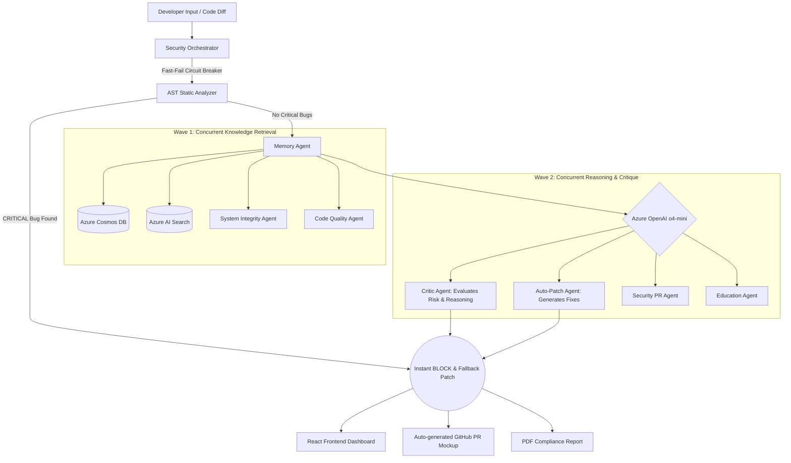
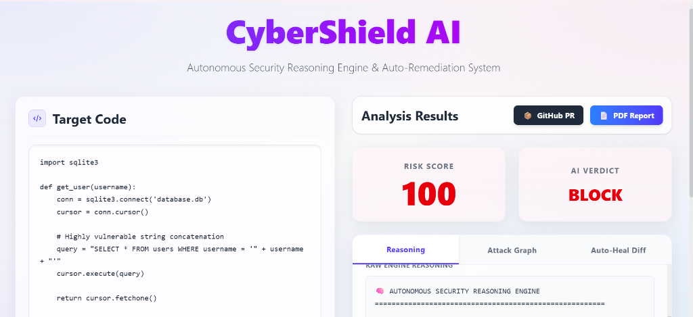
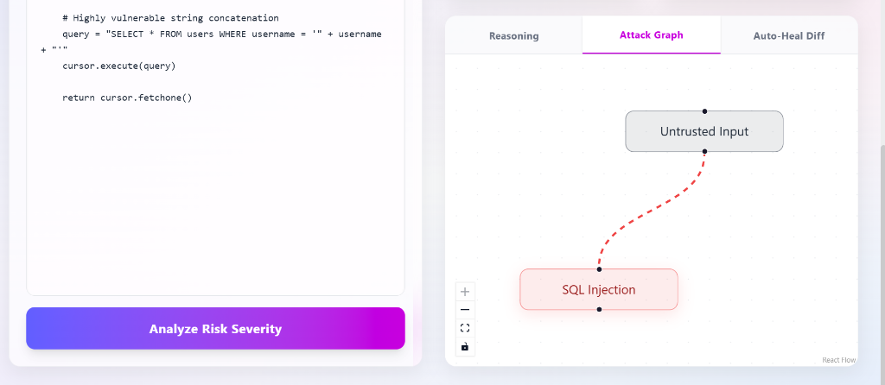

# 🛡️ CyberShield AI
**An autonomous, multi-agent AI security engine that detects, reasons, and self-heals cyber threats in real-time.**

---

## 💡 The Problem
Modern enterprises face severe **vulnerability alert fatigue**. Traditional static analysis security tools bombard development teams with thousands of flaw notifications (many of which are false positives) without evaluating the **runtime context** or reachability of the vulnerability. This results in critical security delays, developer burnout, slow SOC response times, and exposure to active exploits.

## ✨ The Solution
**CyberShield AI** acts as an autonomous security operator. Unlike traditional tools that just flag errors, CyberShield uses **Multi-Agent Reasoning** to actively evaluate the code, cross-reference historical data, and automatically generate a safe, patched version of the code. 

**Why it is better:** It utilizes an Enterprise-Grade **Hybrid Architecture**. It uses Azure AI as the primary reasoning layer, Azure Cosmos DB for persistent memory, and Azure AI Search for RAG (Retrieval-Augmented Generation). It utilizes extreme parallelization to run up to 13 AI agents concurrently, providing lightning-fast risk assessment.

---

## 🏗️ Architecture Data Flow



---

## ⚙️ Tech Stack
- **AI Models:** Azure OpenAI `o4-mini` (Auto-Patching, Critic Reasoning, Education)
- **Knowledge Base (RAG):** Azure AI Search
- **Persistent Memory:** Azure Cosmos DB (Serverless NoSQL)
- **Backend:** Python, FastAPI, Pydantic, ThreadPoolExecutor (Parallelization)
- **Frontend:** React, Vite, TailwindCSS (Glassmorphism), ReactFlow (Attack Graphs)
- **Reporting:** ReportLab (Clean, Emoji-safe PDFs)

---

## 🚀 How It Works (Step-by-Step)
1. **Input:** A developer submits a code snippet via the UI.
2. **Fast-Fail Circuit Breaker:** The static AST analyzer instantly scans for known CRITICAL vulnerabilities (SQLi, XXE, XSS, Path Traversal, Secrets). If found, it bypasses the LLM and instantly returns a `BLOCK` verdict with a deterministic patch and attack graph in < 10ms.
3. **Orchestration:** If the code is not overtly malicious, the central `SecurityOrchestrator` blasts the code to multiple Azure AI agents simultaneously.
4. **Knowledge Retrieval:** The **Memory Agent** queries Cosmos DB for historical occurrences, while the **RAG Agent** searches Azure AI Search for enterprise mitigation policies.
5. **Reasoning & Critique:** The **Critic Agent** (o4-mini) analyzes the code, attack paths, and knowledge bases to generate a multi-step reasoning chain.
6. **Auto-Remediation:** The **Patch Agent** drafts a secure, drop-in replacement version of the code.
7. **Output:** The system produces a final Risk Verdict, an Auto-Heal diff, and exports the results to a GitHub PR Mockup and a downloadable PDF.

---

## 🔥 Finalist-Level Features
- **Hybrid Security Engine:** The ultimate fusion of deterministic rules and generative AI. The **Fast-Fail Circuit Breaker** catches obvious flaws instantly, saving expensive Azure API tokens, while the 60-second deep LLM pass catches hidden logic bugs.
- **Deterministic Auto-Patch Fallback:** If the Circuit Breaker trips, the Auto-Patch Agent seamlessly falls back to a deterministic regex engine to rewrite vulnerable code instantly without hitting the cloud.
- **The Reflection Loop:** The Critic Agent actively evaluates findings and re-triggers analysis passes to ensure absolute confidence before finalizing the verdict.
- **True Memory Learning:** Cosmos DB does not just store scans. It remembers successful patches and dynamically calculates a Patch Confidence Score based on historical success rates.
- **LLM-Based Attack Path Generation:** Uses Azure OpenAI to dynamically reason through vulnerabilities and generate customized, multi-step attack chains, moving beyond static rules.
- **RAG Integration:** Uses Azure AI Search to provide enterprise-aware security context.
- **Extreme Parallelization:** Executes 10+ LLM reasoning calls concurrently for ultra-fast response times on deep scans.
- **Auto-Heal:** Generates drop-in replacement code that fixes the vulnerability.
- **Report Generation:** One-click PDF compliance reports and GitHub PR summaries.
- **Attack Graph Visualization:** Generates dynamic ReactFlow diagrams mapping the attack vectors.

---

## 💻 Setup Instructions

```bash
# 1. Clone the repository
git clone https://github.com/yourusername/cybershield-ai.git
cd cybershield-ai

# 2. Setup the Python Backend
python -m venv secenv
secenv\Scripts\activate  # Windows
pip install -r requirements.txt

# 3. Add your Azure Environment Variables
# Create a .env file based on the provided configuration.
echo "AZURE_OPENAI_API_KEY=your_key" > .env
# Include COSMOS_DB_URI, COSMOS_DB_KEY, AZURE_SEARCH_ENDPOINT, AZURE_SEARCH_KEY

# 4. Run the Backend API
python api.py

# 5. Run the React Frontend (in a new terminal)
cd frontend
npm install
npm run dev
```

Visit `http://localhost:5173` to see the autonomous agent in action!

---

## 📸 Output Screenshots

Here is what the judges will see:

### Target Code & Reasoned Verdict


### Attack Graph Flow & Auto-Heal Diff
