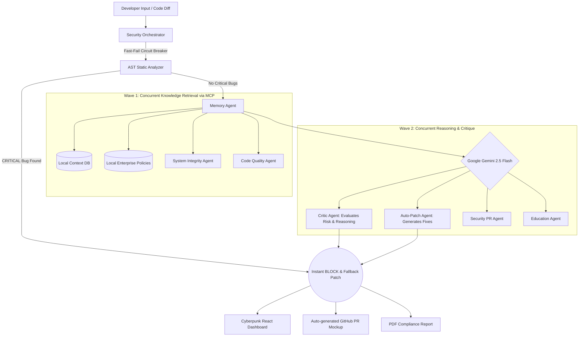
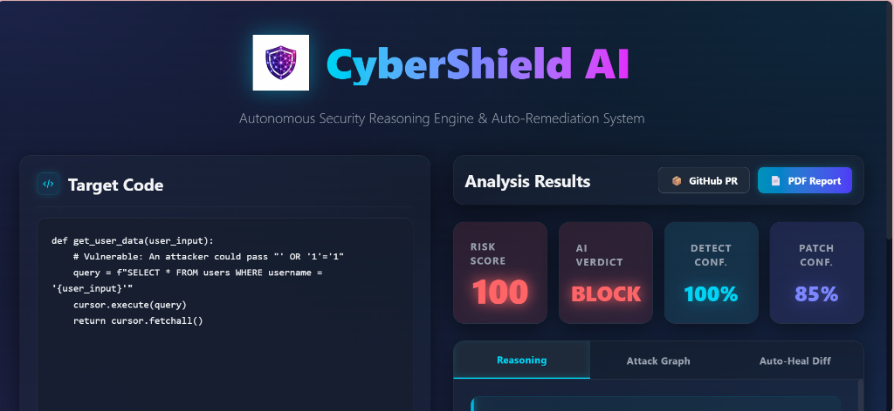
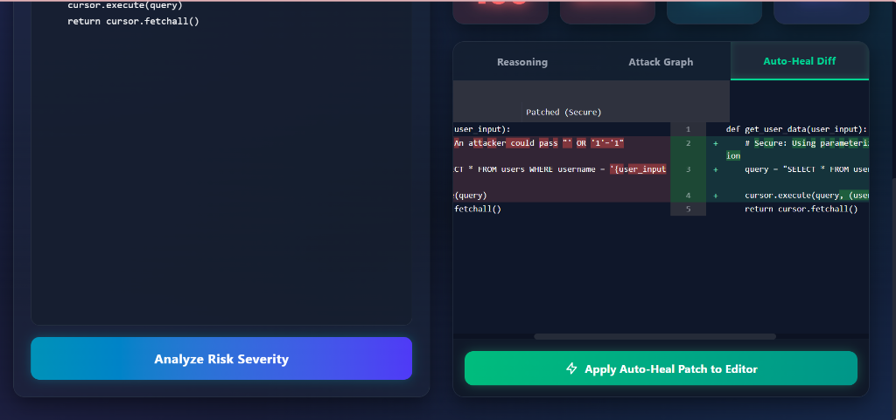
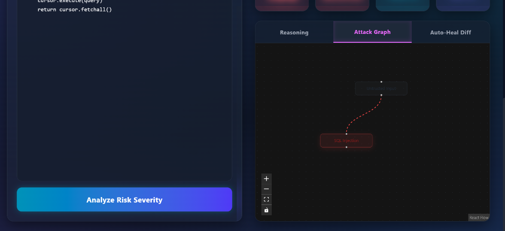

# 🛡️ CyberShield AI
**An autonomous, multi-agent AI security engine that detects, reasons, and self-heals cyber threats using Google Gemini and the Model Context Protocol (MCP).**

---

## 💡 The Problem
Modern enterprises face severe **vulnerability alert fatigue**. Traditional static analysis security tools bombard development teams with thousands of flaw notifications (many of which are false positives) without evaluating the **runtime context** or reachability of the vulnerability. This results in critical security delays, developer burnout, slow SOC response times, and exposure to active exploits.

## ✨ The Solution
**CyberShield AI** acts as an autonomous security operator. Unlike traditional tools that just flag errors, CyberShield uses **Multi-Agent Reasoning** powered by Google Gemini to actively evaluate the code, cross-reference historical data via local MCP tools, and automatically generate a safe, patched version of the code. 

**Why it is better:** It utilizes an Enterprise-Grade **Hybrid Architecture**. It uses Google Gemini 2.5 Flash as the primary reasoning layer and a Model Context Protocol (MCP) server for local tool execution and persistent memory. It utilizes extreme parallelization to run up to 13 AI agents concurrently, providing lightning-fast risk assessment.

---

## 🏗️ Architecture Data Flow



---

## ⚙️ Tech Stack
- **AI Models:** Google Gemini 2.5 Flash (via `google-genai` SDK)
- **Tool Protocol:** Model Context Protocol (MCP) using `fastmcp`
- **Backend:** Python, FastAPI, Pydantic, ThreadPoolExecutor (Parallelization)
- **Frontend:** React, Vite, TailwindCSS (Cyberpunk Glassmorphism), ReactFlow (Attack Graphs)
- **Reporting:** ReportLab (Clean, Emoji-safe PDFs)

---

## 🚀 How It Works (Step-by-Step)
1. **Input:** A developer submits a code snippet via the UI.
2. **Fast-Fail Circuit Breaker:** The static AST analyzer instantly scans for known CRITICAL vulnerabilities (SQLi, XXE, XSS, Path Traversal, Secrets). If found, or if the API is offline, it bypasses the LLM and instantly returns a `BLOCK` verdict with a deterministic patch and attack graph in < 10ms.
3. **Orchestration:** If the code is not overtly malicious, the central `SecurityOrchestrator` utilizes MCP to blast the code to multiple Gemini AI agents simultaneously.
4. **Knowledge Retrieval:** The **Memory Agent** queries local JSON databases for historical occurrences via the MCP server.
5. **Reasoning & Critique:** The **Critic Agent** (Gemini 2.5 Flash) analyzes the code, attack paths, and knowledge bases to generate a multi-step reasoning chain.
6. **Auto-Remediation:** The **Patch Agent** drafts a secure, drop-in replacement version of the code.
7. **Output:** The system produces a final Risk Verdict, an Auto-Heal diff, and exports the results to a stunning Cyberpunk dashboard.

---

## 🔥 Finalist-Level Features
- **Hybrid Security Engine:** The ultimate fusion of deterministic rules and generative AI. The **Fast-Fail Circuit Breaker** catches obvious flaws instantly, while the deep Gemini LLM pass catches complex logic bugs.
- **Model Context Protocol (MCP):** All system tools, file system accesses, and attack path generators are seamlessly routed through an MCP server, demonstrating state-of-the-art agent architecture.
- **Deterministic Auto-Patch Fallback:** If the LLM is unavailable or the Circuit Breaker trips, the Auto-Patch Agent seamlessly falls back to a deterministic regex engine to rewrite vulnerable code instantly without hitting the cloud.
- **The Reflection Loop:** The Critic Agent actively evaluates findings and re-triggers analysis passes to ensure absolute confidence before finalizing the verdict.
- **LLM-Based Attack Path Generation:** Uses Gemini to dynamically reason through vulnerabilities and generate customized, multi-step attack chains, moving beyond static rules.
- **Extreme Parallelization:** Executes 10+ LLM reasoning calls concurrently for ultra-fast response times on deep scans.
- **Cyberpunk UI:** An incredibly immersive, dark-mode glassmorphism interface that makes security analysis visually stunning.

---

## 💻 Setup Instructions

```bash
# 1. Clone the repository
git clone https://github.com/SyedaaMuskan/CyberSheild-AI.git
cd cybersheild-ai

# 2. Setup the Python Backend
python -m venv secenv
secenv\Scripts\activate  # Windows
pip install -r requirements.txt

# 3. Add your Environment Variables
echo "GEMINI_API_KEY=your_gemini_api_key_here" > .env

# 4. Run the Backend API
python api.py

# 5. Run the React Frontend (in a new terminal)
cd frontend
npm install
npm run dev
```

Visit `http://localhost:5173` to see the autonomous agent in action!

---

## 📸 Output Screenshots

Here is what the dashboard looks like in action:

### Main Dashboard & Risk Analysis


### Dynamic Attack Graph Generation


### Auto-Heal Diff (Deterministic Fallback / LLM Patch)
